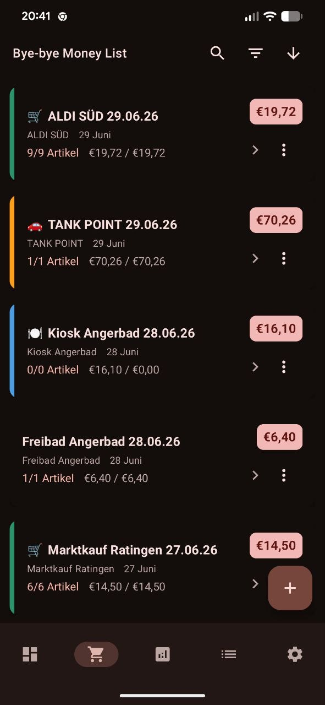
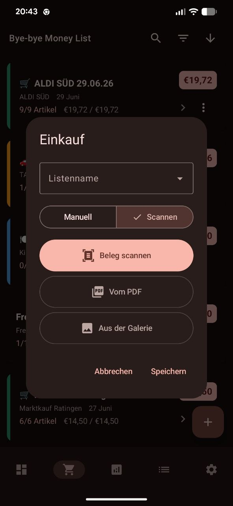
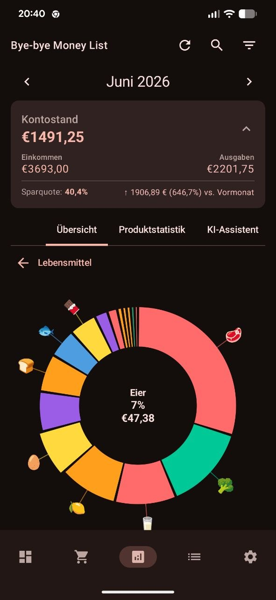

<p align="center">
  
</p>

<h1 align="center">ByeByeMoneyList</h1>

<p align="center"><b>Your spending, organized automatically.</b></p>

<p align="center">
  
  
  
  
</p>

**ByeByeMoneyList is an AI-powered shopping and expense tracking app that turns receipts into organized financial data — in seconds.**

Take a photo of your receipt. AI recognizes the purchased items, identifies the store, categorizes your purchases according to your personal category structure, and records everything automatically.

> **Scan → Recognize → Categorize → Save.** One click to scan. One click to save. Your expenses are organized.

<p align="center">
  
  
  
</p>

## Features

- 🧾 **Receipt scanning** — snap a photo and let AI extract products, prices, and the store.
- 🏪 **Merchant detection** — stores are recognized and created automatically.
- 📂 **Your category hierarchy** — start from the built-in tree, then reshape it to fit the way you manage money.
- 📊 **Statistics & charts** — understand your spending by category, store, month, and year.
- 🛒 **Shopping lists** — create and manage the things you need to buy.
- 💰 **Income** — record income manually and keep it alongside your expenses.
- 🔁 **Subscriptions & recurring purchases** — regular payments never disappear from your overview.
- 🧭 **Dashboard** — a quick overview of recent spending, income, categories, and stores.

## How it works

1. **Scan** — capture a receipt with CameraX and read the text on-device with ML Kit.
2. **Recognize** — an LLM (Google Gemini, SiliconFlow, or DeepSeek — your choice) parses the items.
3. **Categorize** — purchases are matched against your personal category hierarchy.
4. **Save** — expenses, products, and the store are persisted to the local database.

## Tech stack

| Layer | Technology |
| --- | --- |
| Language | Kotlin 2.0 |
| UI | Jetpack Compose + Material 3 |
| Architecture | MVVM with Clean Architecture |
| Storage | Room (SQLite) |
| Camera / OCR | CameraX + ML Kit Text Recognition |
| AI | Gemini, SiliconFlow, DeepSeek |
| Charts | MPAndroidChart |
| Build | Gradle 8 (Kotlin DSL), Version Catalog |

## Getting started

**Requirements:** Android Studio (latest), JDK 17, Android SDK for API 36. The app runs on Android 10+ (API 29).

```bash
git clone git@github.com:rykhalskyi/byebyemoneylist.git
cd byebyemoneylist
./gradlew assembleDebug
```

Optional build settings live in `local.properties`:

```properties
SILICON_FLOW_KEY=           # default AI key, if you want one preconfigured
NEXTCLOUD_SYNC_ENABLED=false
CLOUD_SHARE_ENABLED=false
IMPRESSUM_PUBLISHER=
IMPRESSUM_EMAIL=
```

Alternatively, add your LLM API key at runtime in **Settings → AI**.

### Tests and checks

```bash
./gradlew test          # unit tests
./gradlew lint          # Android Lint
```

## Project structure

```
app/src/main/java/com/otakeeesen/byebyemoneylist/
├── data/        # repositories, Room, preferences, models, LLM providers
├── ui/          # Compose screens, components, ViewModels
└── util/        # shared helpers
```

## Privacy

ByeByeMoneyList is **local-first**: your data stays on your device in a local Room database. Receipt text is sent to the AI provider you configure only to recognize and categorize purchases. See [PRIVACYPOLICY.md](PRIVACYPOLICY.md) for details.

## License

[MIT](LICENSE) © 2026 rykhalskyi
